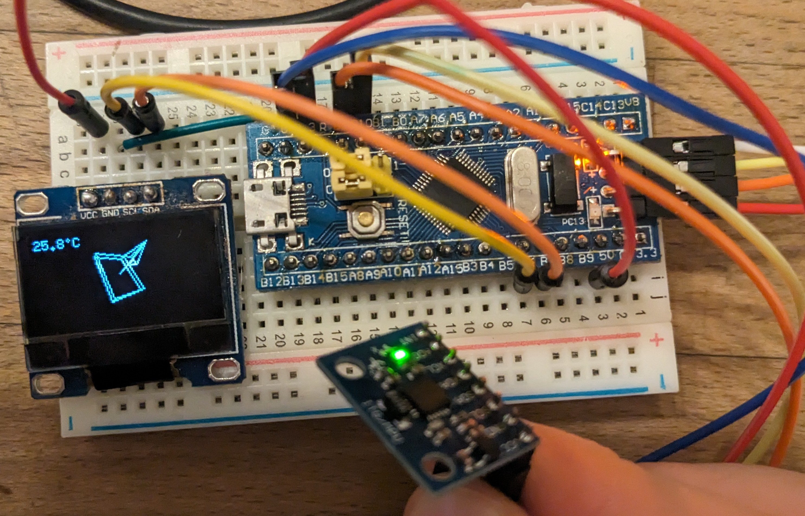

# Playing around with an STM32F103 "Blue Pill" board

✨ Embedded Rust ✨

Making the STM32F103 talk to various crap I have lying around.

Take a look inside [examples](/examples/).

## Requirements

Install these programs with your package manager of choice:

- `arm-none-eabi-gdb` (aka `gdb-multiarch` or `gdb-arm-none-eabi`)
- `openocd`

And with `rustup` install the correct ARM support:

```sh
rustup target install thumbv7m-none-eabi
```

## Build & Run

Connect the ST-LINK v2 (if you have a different programmer, edit [openocd.cfg](/openocd.cfg) accordingly).

In one terminal run `openocd` (it should say `Listening on port 3333 for gdb connections`).

In another terminal run `cargo run --release` for blinky, or `cargo run --release --example={...}` for any of the programs in [examples](/examples/).

## Pictures

### [MPU6050 & SSD1306](/examples/mpu6050.rs)


